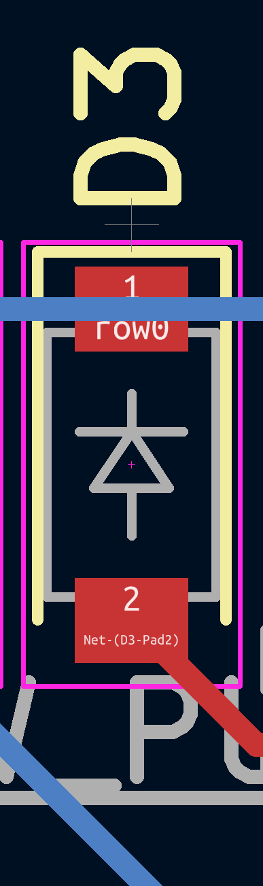

# Build guide

First of all, prepare PCB and parts.

## PCB

1. Download production file from release page.
   1. Don't unzip it. Send the zip file as it is.
2. Send it to PCB manufacture like JLCPCB.

## Parts list

|Item name|number|
|-|-|
|Raspberry Pi Pico|1|
|Kailh x switch|4|
|1N4148W(diode)|4|

## Assemble

It is very easy to build.

 - Be careful to check front/back side.
   - Solder all items on the side is printed footprint.
 - All diodes face same direction (North)

## Write firmware to your pico

I used PRK firmware.

1. Do [tutorial of PRK firmware](https://github.com/picoruby/prk_firmware/wiki/Tutorial).
2. Use [keymap.rb](keymap.rb) as default keymap.
3. Enjoy!
