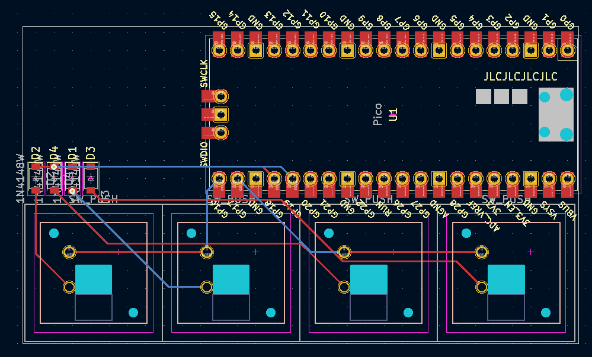
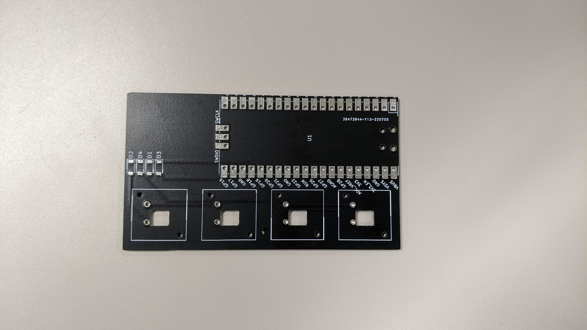

# Thin-key

- Kailh x switch
- 4x1 matrix
- 77 mm x 44 mm
  - You can order this pcb for 2dollars at JLCPCB
- Raspberry Pi Pico

## How to create

[See this build guide page](BUILD_GUIDE.md)

## Pictures

If you create your product, Please make PR with your pictures!

Scheme image

The front side of PCB manufactured by JLCPCB.

The back side of PCB manufactured by JLCPCB.

